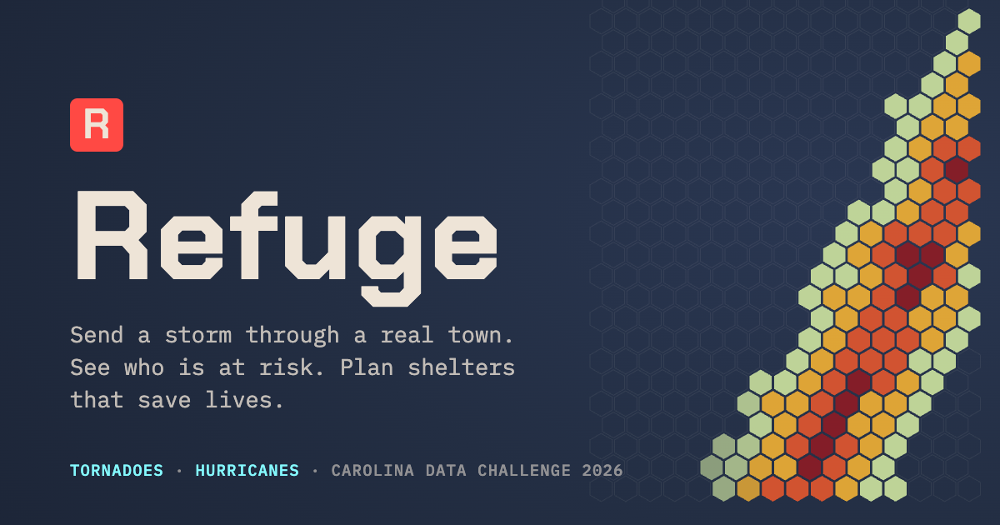

<div align="center">



1st place, Carolina Data Challenge 2026 (Natural Science track)

**[Play it at refugestorms.vercel.app](https://refugestorms.vercel.app)**


</div>

## What Refuge is

Refuge lets you send a tornado or a hurricane through a real American town and watch what happens. You see which neighborhoods are most at risk and why, then you get to do something about it by turning existing schools, churches and businesses into shelters. When you're done planning, the storm runs again with your shelters in place and you can compare your plan with the best one we could find.

Every number in the game comes from real data. The buildings and how many people live in them come from the national structure inventory, the risk comes from thirty years of storm records, and the storm itself follows the physics of real tornadoes and hurricanes.

## Any town in the U.S.

Search for any city or town and Refuge builds it in your browser in about a minute. It pulls buildings and populations from the USACE National Structure Inventory, outlines, heights, roads and rivers from OpenStreetMap, elevation from AWS Terrain Tiles, and the town boundary from Census TIGERweb. Bigger cities get cropped to a 15 by 15 km area of your choosing, with up to 20,000 buildings. Towns you build are saved in your browser.

The builder lives in `web/src/builder/` and follows the same rules as the Python pipeline in `places/`, so a Lumberton built in the browser matches the Python one building for building.

## The models behind it

We started with every storm in the NOAA Storm Events Database from 1996 to 2025 and asked two questions: which storms kill people, and where are people when it happens?

**National risk model.** A LightGBM Poisson model predicts deaths per storm from things like tornado strength and size, time of day, season, and the share of mobile homes, older residents and households without a car in the county. We trained it on storms through 2019 and tested it on 2020 to 2025, which it had never seen. It picked out the deadly storms well (AUC 0.83), and the 10% of storms it flagged as most dangerous accounted for about 70% of all deaths. SHAP values show which factors drive each prediction.

**Where people die.** A second model estimates where deaths happen: mobile homes, houses, public buildings, vehicles, water or outdoors. That tells the game where shelters help most.

**The simulator.** Mahil's engine sends the storm across every building in town. We calibrated its five main settings (how dangerous mobile homes, houses and public buildings are, how much worse night is, and how much basements help) on 48 real tornadoes, then checked it on 30 more it was never fit to. Hurricanes follow real NOAA HURDAT2 tracks through a Holland wind field model, with storm size fit on 891 historical observations, plus a damage model for how many people get displaced.

## Running it locally

<details>
<summary><b>The site</b></summary>

The site is in `web/` (React and React Three Fiber).

```bash
npm ci --prefix web
npm run dev --prefix web
```
 The Structure Inventory and one OpenStreetMap server go through same-origin proxy paths (`/nsi-api`, `/overpass-api`), set up in `web/vite.config.ts` locally and `vercel.json` on the live site.
</details>

<details>
<summary><b>Simulation engine tests</b></summary>

```bash
npm ci --prefix sim
npm test --prefix sim
```
</details>

<details>
<summary><b>Building a town with Python</b></summary>

The featured towns were built this way.

```bash
python3.12 -m venv places/.venv
places/.venv/bin/pip install -r places/requirements.txt
places/.venv/bin/python places/build_server.py
```
</details>

<details>
<summary><b>Rebuilding the ML outputs</b></summary>

The outputs are already in `ml/exports/` and `sim/params/sim_params.json`, so you only need this to rebuild them.

```bash
python3.12 -m venv ml/.venv
ml/.venv/bin/pip install -r ml/requirements.txt

ml/.venv/bin/python ml/download.py          # NOAA, SVI, FHWA files into data/raw/ (about 320 MB)
ml/.venv/bin/python ml/build_tables.py      # cleaned tables into data/processed/
ml/.venv/bin/python ml/patterns.py          # deaths by hour, month and location
ml/.venv/bin/python ml/train_risk.py        # national risk model, SHAP, county map
ml/.venv/bin/python ml/train_location.py    # where deaths happen
ml/.venv/bin/python ml/traffic_curve.py     # hourly traffic for road crossings
ml/.venv/bin/python ml/backtest_select.py   # historical tornadoes for calibration and backtest
ml/.venv/bin/python ml/calibrate.py fit     # fit the simulator (needs `npm run build --prefix sim`)
ml/.venv/bin/python ml/heatmap_bands.py     # risk map bands into sim/params/sim_params.json
ml/.venv/bin/python ml/calibrate.py backtest
ml/.venv/bin/python ml/hurricane_wind.py    # hurricane wind model
ml/.venv/bin/python ml/hurricane_calibrate.py
ml/.venv/bin/python ml/hurricane_damage.py
ml/.venv/bin/python ml/story_exports.py     # data for the charts
```
</details>

<details>
<summary><b>Story charts</b></summary>

See `story/README.md`. Each script downloads the NOAA data it needs and writes a self-contained HTML chart.
</details>

## What's in here

```
refuge/
├── web/      the site, the game and the 3D town (React, React Three Fiber)
├── sim/      the storm engine: tornado and hurricane effects, shelters, plan optimizer
├── places/   the town builder and the prebuilt towns
├── ml/       risk and location models, simulator calibration, backtests, chart data
└── story/    the data story charts
```

## Data

NOAA Storm Events Database (1996 to 2025), NOAA HURDAT2, CDC/ATSDR Social Vulnerability Index 2022, USACE National Structure Inventory, USGS 3DEP elevation, OpenStreetMap, and the FHWA travel survey and highway statistics.

## Team

| | |
|---|---|
| **Pranav Somalraju** | Machine learning: the national risk and location models, simulator calibration and backtests, the hurricane wind and damage models, and the data behind the charts |
| **Mahil Manoharan** | The simulation engine |
| **Soham Patki** | Town data and the 3D town |
| **Ananya Anchlia** | The data story and the site |
